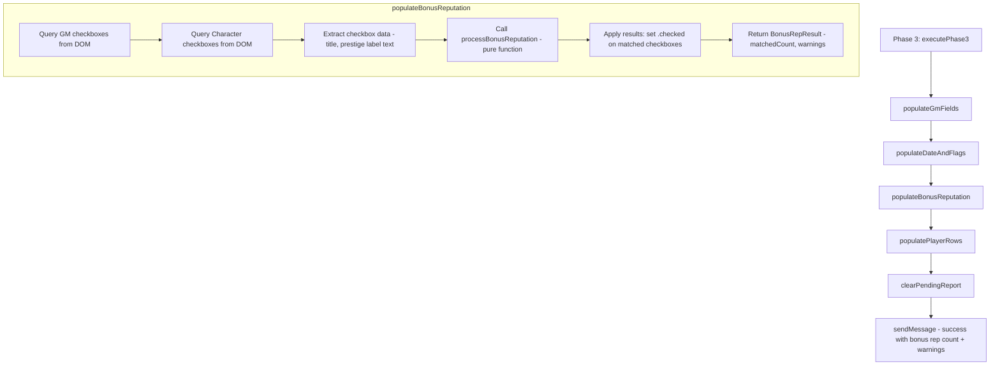
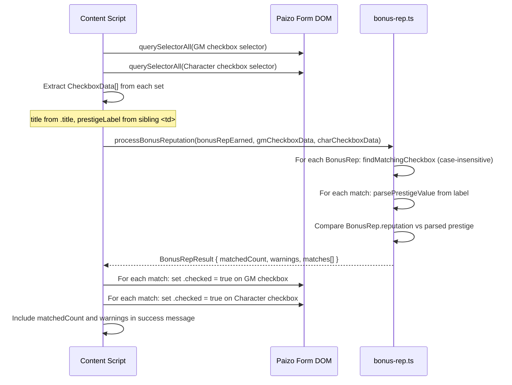

# Design Document: Extra Reputation Reporting

## Overview

This feature extends the pfs-session-reporter browser extension to handle "special faction objective" checkboxes on the Paizo session reporting form. Certain PFS2E scenarios include extra reputation tied to specific factions. The Paizo form renders these as two sets of checkboxes — one for the GM and one for all characters — that appear only after a scenario is selected. The extension already receives `bonusRepEarned` data in the `SessionReport` but currently ignores it.

This design adds a new pure-function module (`bonus-rep.ts`) that encapsulates all matching, parsing, and validation logic for bonus reputation processing. The content script calls this module during Phase 3 to check the appropriate checkboxes and warn the GM about any prestige value mismatches between the session report and the form.

### Key Design Decisions

1. **Pure function module for testability**: All matching and parsing logic lives in `src/shared/bonus-rep.ts` as pure functions that accept data parameters (not DOM elements). The content script handles DOM queries and mutations, passing extracted data to the pure functions. This follows the existing pattern (e.g., `faction-map.ts`, `scenario-matcher.ts`) and enables property-based testing without JSDOM.

2. **Case-insensitive faction matching**: The `BonusRep.faction` value is matched against checkbox `title` attributes using case-insensitive comparison. This guards against casing differences between the chronicle generator and the Paizo form HTML.

3. **Warnings don't block the workflow**: Prestige mismatches and unmatched factions produce warnings that are collected and appended to the success message. The workflow always continues — checkboxes are still checked even when a mismatch is detected.

4. **Defensive handling of missing/undefined bonusRepEarned**: The processing function treats `undefined` and empty arrays identically, returning an empty result. This ensures backward compatibility with older SessionReport payloads that may not include the field.

5. **Both checkbox sets checked for each faction**: Each `BonusRep` entry checks both the GM and character checkbox sets. The Paizo form expects both to be checked when a faction objective is fulfilled.

## Architecture

The feature integrates into the existing Phase 3 workflow. No new phases, message types, or storage mechanisms are introduced.



### Module Structure (changes only)

```
src/
├── content/
│   └── content-script.ts      # Modified: calls populateBonusReputation in Phase 3
├── shared/
│   └── bonus-rep.ts            # NEW: pure functions for bonus rep matching/parsing
└── constants/
    └── selectors.ts            # Modified: adds faction objective checkbox selectors
```

### Data Flow



## Components and Interfaces

### New Module: `src/shared/bonus-rep.ts`

Pure functions for bonus reputation matching, prestige parsing, and mismatch detection.

```typescript
/**
 * Extracted checkbox data passed from the content script to pure functions.
 * Avoids passing DOM elements into the pure function layer.
 */
export interface CheckboxData {
  /** The faction name from the checkbox title attribute */
  title: string;
  /** The raw text content of the sibling prestige label <td>, e.g. "(2 prestige)" */
  prestigeLabelText: string | null;
  /** An identifier to correlate back to the DOM element (e.g., the name attribute) */
  identifier: string;
}

/**
 * A single match result for one BonusRep entry against one checkbox set.
 */
export interface CheckboxMatch {
  /** The identifier of the matched checkbox (from CheckboxData.identifier) */
  checkboxIdentifier: string;
  /** The faction name from the BonusRep entry */
  faction: string;
}

/**
 * The result of processing all BonusRep entries against both checkbox sets.
 */
export interface BonusRepResult {
  /** Number of BonusRep entries that matched at least one checkbox */
  matchedCount: number;
  /** Warning messages for unmatched factions and prestige mismatches */
  warnings: string[];
  /** Matched GM checkbox identifiers to set .checked = true */
  gmMatches: CheckboxMatch[];
  /** Matched Character checkbox identifiers to set .checked = true */
  characterMatches: CheckboxMatch[];
}

/**
 * Find the CheckboxData entry whose title matches the given faction name
 * (case-insensitive comparison).
 *
 * Returns the matching CheckboxData, or null if no match is found.
 */
export function findMatchingCheckbox(
  faction: string,
  checkboxes: CheckboxData[],
): CheckboxData | null;

/**
 * Parse the integer prestige value from a prestige label string.
 * Expects the pattern "(N prestige)" where N is a non-negative integer.
 *
 * Returns the parsed integer, or null if the string doesn't match the pattern.
 */
export function parsePrestigeValue(labelText: string): number | null;

/**
 * Process all BonusRep entries against both GM and Character checkbox sets.
 *
 * For each BonusRep entry:
 * 1. Searches both checkbox sets for a title match (case-insensitive)
 * 2. If matched, parses the prestige label and compares to BonusRep.reputation
 * 3. Collects warnings for unmatched factions and prestige mismatches
 *
 * Returns a BonusRepResult with matched checkbox identifiers and warnings.
 */
export function processBonusReputation(
  bonusRepEarned: BonusRep[] | undefined,
  gmCheckboxes: CheckboxData[],
  characterCheckboxes: CheckboxData[],
): BonusRepResult;
```

### Modified Module: `src/constants/selectors.ts`

Two new selector constants added to the `SELECTORS` object:

```typescript
export const SELECTORS = {
  // ... existing selectors ...

  // Special faction objective checkboxes
  gmFactionObjectiveCheckboxes: 'input[name^="17.2.1.3.1.1.1.31.1."]',
  characterFactionObjectiveCheckboxes: 'input[name^="17.2.1.3.1.1.1.33.1."]',
} as const;
```

### Modified Module: `src/content/content-script.ts`

A new `populateBonusReputation` function is added and called within `executePhase3`, between `populateDateAndFlags` and `populatePlayerRows`. The success message is updated to include the matched count and any warnings.

```typescript
/**
 * Extracts CheckboxData from a NodeList of checkbox input elements.
 * For each checkbox, reads the title attribute and the text content
 * of the next sibling <td> element (the prestige label).
 */
function extractCheckboxData(
  checkboxes: NodeListOf<HTMLInputElement>,
): CheckboxData[];

/**
 * Populates special faction objective checkboxes based on bonusRepEarned data.
 * Returns a BonusRepResult with matched count and warnings.
 */
function populateBonusReputation(report: SessionReport): BonusRepResult;
```

The `executePhase3` function is modified to:
1. Call `populateBonusReputation` after `populateDateAndFlags`
2. Include the matched count in the success message
3. Append any warnings to the success message

## Data Models

### Existing Types (unchanged)

```typescript
// From src/shared/types.ts
interface BonusRep {
  faction: string;     // Full faction name, e.g. "Verdant Wheel"
  reputation: number;  // Reputation value, e.g. 2
}

interface SessionReport {
  // ... existing fields ...
  bonusRepEarned: BonusRep[];  // Already defined, currently unused
}
```

### New Types (in `src/shared/bonus-rep.ts`)

```typescript
interface CheckboxData {
  title: string;                    // From checkbox title attribute
  prestigeLabelText: string | null; // From sibling <td> text, e.g. "(2 prestige)"
  identifier: string;               // Checkbox name attribute for DOM correlation
}

interface CheckboxMatch {
  checkboxIdentifier: string;  // Name attribute of matched checkbox
  faction: string;             // Faction name from BonusRep
}

interface BonusRepResult {
  matchedCount: number;        // Count of BonusRep entries with at least one match
  warnings: string[];          // Warning messages (unmatched factions, mismatches)
  gmMatches: CheckboxMatch[];  // GM checkboxes to check
  characterMatches: CheckboxMatch[];  // Character checkboxes to check
}
```

### Paizo Form HTML Structure

The prestige label is the `<td>` element immediately after the `<td>` containing the checkbox:

```html
<tr>
  <td>Verdant Wheel:  </td>                    <!-- Label -->
  <td><input title="Verdant Wheel" ... /></td>  <!-- Checkbox -->
  <td>(2 prestige)</td>                         <!-- Prestige Label -->
</tr>
```

The content script navigates from the checkbox's parent `<td>` to the next sibling `<td>` to read the prestige label text. This DOM traversal is done in the content script (not in the pure function module).

## Correctness Properties

*A property is a characteristic or behavior that should hold true across all valid executions of a system — essentially, a formal statement about what the system should do. Properties serve as the bridge between human-readable specifications and machine-verifiable correctness guarantees.*

### Property 1: Case-insensitive faction matching finds correct checkbox

*For any* faction name string and *for any* set of `CheckboxData` entries where exactly one entry has a `title` that equals the faction name (ignoring case), `findMatchingCheckbox` should return that entry.

**Validates: Requirements 2.1, 2.2**

### Property 2: Unmatched faction returns null

*For any* faction name string and *for any* set of `CheckboxData` entries where no entry has a `title` that equals the faction name (ignoring case), `findMatchingCheckbox` should return `null`.

**Validates: Requirements 2.5**

### Property 3: Prestige label parsing round-trip

*For any* non-negative integer N, formatting it as `"(N prestige)"` and passing the result to `parsePrestigeValue` should return N. Conversely, *for any* string that does not match the `"(N prestige)"` pattern, `parsePrestigeValue` should return `null`.

**Validates: Requirements 6.1, 6.5**

### Property 4: Prestige mismatch detection

*For any* `BonusRep` entry matched to a `CheckboxData` entry with a valid prestige label, `processBonusReputation` should produce a warning if and only if the `BonusRep.reputation` value differs from the parsed prestige integer. The warning message should contain the faction name, the `BonusRep.reputation` value, and the parsed prestige value.

**Validates: Requirements 6.2, 6.4**

### Property 5: Bonus reputation processing produces correct matched count

*For any* list of `BonusRep` entries and *for any* pair of `CheckboxData` arrays (GM and character), `processBonusReputation` should return a `matchedCount` equal to the number of `BonusRep` entries whose faction matches at least one checkbox title (case-insensitive) in either set.

**Validates: Requirements 4.2**

## Error Handling

The error handling strategy follows the existing extension pattern: warnings are collected and surfaced to the user, but never interrupt the form-filling workflow.

| Scenario | Behavior |
|---|---|
| `bonusRepEarned` is `undefined` | Treated as empty array; `processBonusReputation` returns `{ matchedCount: 0, warnings: [], gmMatches: [], characterMatches: [] }` |
| `bonusRepEarned` is empty array | Same as undefined — returns empty result, no error |
| No faction objective checkboxes on form | `querySelectorAll` returns empty NodeList; `processBonusReputation` receives empty arrays; returns empty result, no error |
| `BonusRep.faction` doesn't match any checkbox title | Warning added: `"Bonus reputation faction 'X' not found among special faction objective checkboxes"` — workflow continues |
| Prestige label `<td>` is missing (no next sibling) | `prestigeLabelText` is `null`; `parsePrestigeValue` returns `null`; warning added: `"Could not parse prestige value for faction 'X' — skipping mismatch check"` — checkbox is still checked |
| Prestige label text doesn't match `"(N prestige)"` pattern | Same as missing — `parsePrestigeValue` returns `null`; warning logged; checkbox still checked |
| Prestige value doesn't match `BonusRep.reputation` | Warning added: `"Warning: X reputation is N in session report but M on form"` — checkbox is still checked |
| Multiple `BonusRep` entries for the same faction | Each entry is processed independently; both will match the same checkbox (idempotent `.checked = true`) |

All warnings are collected in the `BonusRepResult.warnings` array and appended to the success message sent to the popup, so the GM sees them in the extension UI.

## Testing Strategy

### Property-Based Testing

The extension uses `fast-check` (already a devDependency) for property-based testing. All correctness properties are implemented as property tests in a new file: `src/shared/bonus-rep.property.test.ts`.

Each property test must:
- Run a minimum of 100 iterations
- Reference the design property with a tag comment: `Feature: extra-reputation-reporting, Property N: {title}`
- Use `fc.assert` with `{ numRuns: 100 }` configuration

| Property | Test File | Generator Strategy |
|---|---|---|
| Property 1: Case-insensitive faction matching | `bonus-rep.property.test.ts` | Generate random faction name + random casing variation; create `CheckboxData[]` with one matching entry among decoys |
| Property 2: Unmatched faction returns null | `bonus-rep.property.test.ts` | Generate random faction name; create `CheckboxData[]` with no matching titles |
| Property 3: Prestige label parsing round-trip | `bonus-rep.property.test.ts` | Generate random non-negative integers → format as `"(N prestige)"` → parse → assert equals N. Also generate random non-matching strings → parse → assert null |
| Property 4: Prestige mismatch detection | `bonus-rep.property.test.ts` | Generate `BonusRep` with random reputation + `CheckboxData` with random prestige value → run `processBonusReputation` → assert warning present iff values differ |
| Property 5: Bonus rep matched count | `bonus-rep.property.test.ts` | Generate random `BonusRep[]` and `CheckboxData[]` arrays with controlled overlap → run `processBonusReputation` → assert `matchedCount` equals expected |

### Unit Testing

Unit tests cover specific examples, edge cases, and DOM integration in `src/shared/bonus-rep.test.ts` and `src/content/content-script.test.ts`:

**`src/shared/bonus-rep.test.ts`** (pure function tests):
- `findMatchingCheckbox` with exact case match → returns match
- `findMatchingCheckbox` with different casing → returns match
- `findMatchingCheckbox` with empty checkboxes array → returns null
- `parsePrestigeValue` with `"(2 prestige)"` → returns 2
- `parsePrestigeValue` with `"(0 prestige)"` → returns 0
- `parsePrestigeValue` with `""` → returns null
- `parsePrestigeValue` with `"2 prestige"` (no parens) → returns null
- `processBonusReputation` with undefined bonusRepEarned → empty result
- `processBonusReputation` with empty bonusRepEarned → empty result
- `processBonusReputation` with zero checkboxes on form but non-empty bonusRepEarned → warnings for unmatched factions, matchedCount 0
- `processBonusReputation` with one matching faction → matchedCount 1, correct match
- `processBonusReputation` with two matching factions → matchedCount 2, correct matches
- `processBonusReputation` with prestige mismatch → warning in result
- `processBonusReputation` with missing prestige label → warning about unparseable prestige

**`src/content/content-script.test.ts`** (DOM integration, additions to existing test file):
- Phase 3 with bonusRepEarned: checkboxes are checked on the DOM
- Phase 3 with empty bonusRepEarned: no errors, other fields still populated
- Phase 3 with unmatched faction: warning in success message, other fields still populated
- Phase 3 with prestige mismatch: warning in success message, checkbox still checked
- Phase 3 success message includes bonus rep count
- `extractCheckboxData` correctly reads title and sibling `<td>` text from DOM structure
