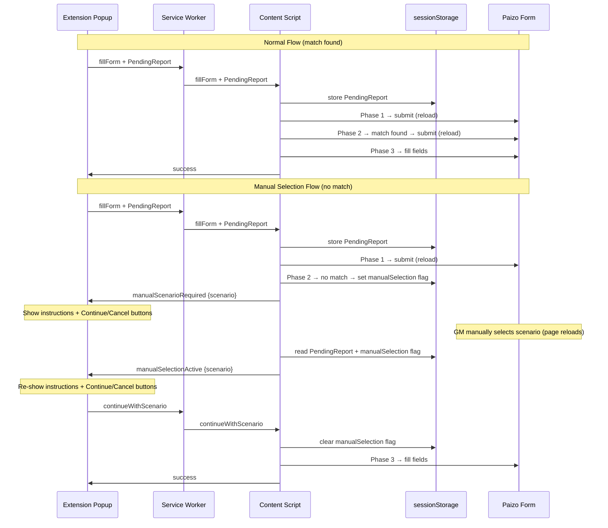
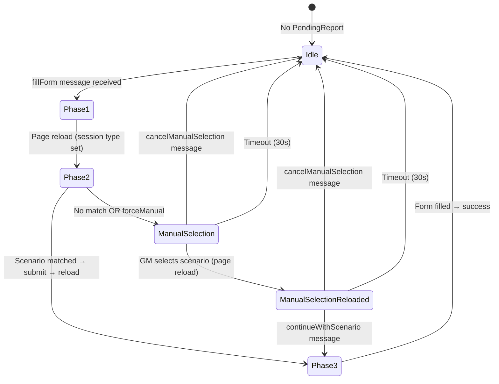

# Design Document: Manual Scenario Selection

## Overview

This feature adds a manual scenario selection fallback to the PFS Session Reporter extension. When the `Scenario_Matcher` cannot automatically match a scenario during Phase 2, instead of erroring out and clearing the `Pending_Report`, the extension enters `Manual_Selection_Mode`. In this mode, the user manually selects the correct scenario from the Paizo form's dropdown (which triggers a page reload), then clicks "Continue with Selected Scenario" in the popup to trigger Phase 3.

The design preserves the existing 3-phase architecture and reload-based state persistence. The key additions are:
- A `manualSelection` flag in sessionStorage alongside the `Pending_Report`
- New message types for communication between popup and content script
- New popup UI states for manual selection instructions, confirmation, and cancellation
- An Option/Alt key modifier on "Fill Form" to force manual selection for testing

### Design Decisions

1. **Separate storage key for the manual selection flag** rather than extending the `PendingReport` type. This keeps the existing `PendingReport` interface unchanged and avoids breaking the serialization contract. The flag is a simple boolean stored under its own sessionStorage key.

2. **Pure function extraction for decision logic** following the existing pattern (e.g., `determinePhase`, `processBonusReputation`). New decision functions (`shouldEnterManualMode`, `isScenarioSelected`) are pure and testable without DOM or Chrome API mocks.

3. **Reuse existing timeout logic** — the `isExpired` function already handles the 30-second timeout. Manual selection mode checks the same timestamp on the existing `PendingReport`.

4. **Message-based state synchronization** — the popup doesn't read sessionStorage directly (it can't — different execution context). The content script sends messages to inform the popup of the current state, and the popup sends messages to trigger actions.

## Architecture

The feature extends the existing message-passing architecture without changing the fundamental flow:



### Force-Manual Flow (Option/Alt key)

When the user holds Option/Alt while clicking "Fill Form":
1. The popup includes `forceManualScenario: true` in the `fillForm` message
2. The content script stores this flag in sessionStorage as `forceManualScenario`
3. After Phase 1 reload, Phase 2 reads the flag and skips scenario matching, entering manual mode directly
4. The `forceManualScenario` flag is cleared when manual selection mode is entered

## Components and Interfaces

### New Storage Keys

```typescript
// In src/constants/selectors.ts
export const MANUAL_SELECTION_KEY = 'pfs_manual_selection';
export const FORCE_MANUAL_KEY = 'pfs_force_manual_scenario';
```

### New Message Types

```typescript
// Content Script → Popup
interface ManualScenarioRequiredMessage {
  type: 'manualScenarioRequired';
  scenario: string;
}

interface ManualSelectionActiveMessage {
  type: 'manualSelectionActive';
  scenario: string;
}

// Popup → Content Script (via Service Worker)
interface ContinueWithScenarioMessage {
  type: 'continueWithScenario';
}

interface CancelManualSelectionMessage {
  type: 'cancelManualSelection';
}

// Extended fillForm message
interface FillFormMessage {
  type: 'fillForm';
  pendingReport: PendingReport;
  forceManualScenario?: boolean;
}
```

### Modified Content Script Functions

#### `executePhase2` Changes

The existing `executePhase2` function is modified to enter manual selection mode instead of erroring when no match is found:

```typescript
function executePhase2(report: SessionReport): void {
  const scenarioSelect = document.querySelector<HTMLSelectElement>(SELECTORS.scenarioSelect);
  const form = document.querySelector<HTMLFormElement>(SELECTORS.form);

  if (!scenarioSelect || !form) {
    clearPendingReport();
    sendMessage({ type: 'error', message: '...' });
    return;
  }

  // Check if force-manual flag is set (from Option/Alt key)
  const forceManual = sessionStorage.getItem(FORCE_MANUAL_KEY) === 'true';
  if (forceManual) {
    sessionStorage.removeItem(FORCE_MANUAL_KEY);
    enterManualSelectionMode(report.scenario);
    return;
  }

  const matchingValue = findScenarioOption(scenarioSelect, report.scenario);
  if (!matchingValue) {
    enterManualSelectionMode(report.scenario);
    return;
  }

  scenarioSelect.value = matchingValue;
  form.submit();
}
```

#### New `enterManualSelectionMode` Function

```typescript
function enterManualSelectionMode(scenario: string): void {
  sessionStorage.setItem(MANUAL_SELECTION_KEY, 'true');
  sendMessage({ type: 'manualScenarioRequired', scenario });
}
```

#### New `handleContinueWithScenario` Function

```typescript
function handleContinueWithScenario(): void {
  const pendingReport = readPendingReport();
  if (!pendingReport) {
    sendMessage({ type: 'error', message: 'No pending report found.' });
    return;
  }

  const scenarioSelect = document.querySelector<HTMLSelectElement>(SELECTORS.scenarioSelect);
  if (!isScenarioSelected(scenarioSelect?.value ?? '')) {
    sendMessage({
      type: 'error',
      message: 'No scenario has been selected. Please select a scenario from the dropdown first.',
    });
    return;
  }

  sessionStorage.removeItem(MANUAL_SELECTION_KEY);
  executePhase3(pendingReport.report);
}
```

#### New `handleCancelManualSelection` Function

```typescript
function handleCancelManualSelection(): void {
  clearPendingReport();
  sessionStorage.removeItem(MANUAL_SELECTION_KEY);
}
```

#### Modified `onPageLoad` Function

```typescript
function onPageLoad(): void {
  const pendingReport = readPendingReport();
  if (!pendingReport) {
    return;
  }

  if (isExpired(pendingReport.timestamp)) {
    clearPendingReport();
    sessionStorage.removeItem(MANUAL_SELECTION_KEY);
    return;
  }

  // If manual selection flag is set, notify popup and wait — don't auto-execute
  const isManualSelection = sessionStorage.getItem(MANUAL_SELECTION_KEY) === 'true';
  if (isManualSelection) {
    sendMessage({ type: 'manualSelectionActive', scenario: pendingReport.report.scenario });
    return;
  }

  const phase = detectPhase(pendingReport.report);
  switch (phase) {
    case 'session-type':
      executePhase1(pendingReport.report);
      break;
    case 'scenario':
      executePhase2(pendingReport.report);
      break;
    case 'fill-fields':
      executePhase3(pendingReport.report);
      break;
  }
}
```

#### Modified Message Listener

```typescript
chrome.runtime.onMessage.addListener(
  (message: Record<string, unknown>) => {
    if (message.type === 'fillForm') {
      if (message.pendingReport) {
        storePendingReport(message.pendingReport as PendingReport);
      }
      if (message.forceManualScenario === true) {
        sessionStorage.setItem(FORCE_MANUAL_KEY, 'true');
      }
      onPageLoad();
    } else if (message.type === 'continueWithScenario') {
      handleContinueWithScenario();
    } else if (message.type === 'cancelManualSelection') {
      handleCancelManualSelection();
    }
  },
);
```

### New Pure Functions (for testability)

```typescript
/**
 * Determines whether a scenario select value represents a valid selection
 * (not the default empty/placeholder value).
 */
export function isScenarioSelected(scenarioSelectValue: string): boolean {
  return scenarioSelectValue !== '' && scenarioSelectValue !== '0';
}

/**
 * Determines whether the content script should enter manual selection mode
 * on page load (when the manual selection flag is set in sessionStorage).
 *
 * Returns true if manual mode should be active (flag is set and report is not expired).
 */
export function shouldEnterManualMode(
  manualSelectionFlag: string | null,
  isReportExpired: boolean,
): boolean {
  if (isReportExpired) {
    return false;
  }
  return manualSelectionFlag === 'true';
}

/**
 * Builds the manualScenarioRequired message payload.
 */
export function buildManualScenarioMessage(scenario: string): { type: string; scenario: string } {
  return { type: 'manualScenarioRequired', scenario };
}
```

### Popup UI Changes

#### New HTML Elements

```html
<!-- Manual selection panel (hidden by default) -->
<div id="manualSelection" class="manual-selection hidden">
  <div class="manual-selection-header">Scenario not found</div>
  <p class="manual-selection-scenario" id="manualScenarioName"></p>
  <p class="manual-selection-instructions">
    Select the correct scenario from the dropdown on the Paizo form, then click Continue.
  </p>
  <button id="continueButton" type="button" class="continue-button">
    Continue with Selected Scenario
  </button>
  <button id="cancelButton" type="button" class="cancel-button">
    Cancel
  </button>
</div>
```

#### New CSS Styles

```css
.manual-selection {
  margin-top: 12px;
}

.manual-selection-header {
  font-weight: 600;
  font-size: 14px;
  color: #b06000;
  margin-bottom: 8px;
}

.manual-selection-scenario {
  font-size: 13px;
  color: #1a1a1a;
  background-color: #f5f5f5;
  padding: 6px 8px;
  border-radius: 4px;
  margin-bottom: 8px;
  font-family: monospace;
}

.manual-selection-instructions {
  font-size: 12px;
  color: #555;
  margin-bottom: 12px;
  line-height: 1.4;
}

.continue-button {
  background-color: #137333;
  margin-bottom: 8px;
}

.continue-button:hover {
  background-color: #0d5a27;
}

.cancel-button {
  background-color: #5f6368;
}

.cancel-button:hover {
  background-color: #4a4e51;
}
```

#### Popup State Management

The popup manages three UI states:

1. **Default state**: "Fill Form" button visible, manual selection panel hidden
2. **Manual selection state**: "Fill Form" button hidden, manual selection panel visible with scenario name, instructions, Continue and Cancel buttons
3. **Loading/Success/Error states**: Unchanged from current behavior

```typescript
// New popup elements
interface PopupElements {
  fillButton: HTMLButtonElement;
  loading: HTMLElement;
  status: HTMLElement;
  manualSelection: HTMLElement;
  manualScenarioName: HTMLElement;
  continueButton: HTMLButtonElement;
  cancelButton: HTMLButtonElement;
}

function showManualSelection(elements: PopupElements, scenario: string): void {
  elements.fillButton.classList.add('hidden');
  elements.loading.classList.add('hidden');
  elements.status.classList.add('hidden');
  elements.manualSelection.classList.remove('hidden');
  elements.manualScenarioName.textContent = scenario;
}

function hideManualSelection(elements: PopupElements): void {
  elements.manualSelection.classList.add('hidden');
  elements.fillButton.classList.remove('hidden');
  elements.fillButton.disabled = false;
}
```

#### Modified `handleFillClick` (Option/Alt key detection)

```typescript
async function handleFillClick(elements: PopupElements, event: MouseEvent): Promise<void> {
  showLoading(elements);

  try {
    const report = await readAndParseClipboard();
    const pendingReport = createPendingReport(report);
    const forceManualScenario = event.altKey;
    sendFillFormMessage(pendingReport, forceManualScenario);
    hideLoading(elements);
  } catch (error: unknown) {
    const message = error instanceof Error ? error.message : 'An unexpected error occurred.';
    showError(elements, message);
  }
}
```

#### Modified Message Listener in Popup

```typescript
function listenForContentScriptMessages(elements: PopupElements): void {
  chrome.runtime.onMessage.addListener(
    (message: Record<string, unknown>) => {
      if (message.type === 'success') {
        const scenarioInfo = message.scenario ? `\nScenario: ${String(message.scenario)}` : '';
        showSuccess(elements, `${String(message.message)}${scenarioInfo}`);
      } else if (message.type === 'error') {
        showError(elements, String(message.message));
      } else if (message.type === 'manualScenarioRequired' || message.type === 'manualSelectionActive') {
        showManualSelection(elements, String(message.scenario));
      }
    },
  );
}
```

### Service Worker Changes

No changes needed. The service worker already forwards all messages bidirectionally between popup and content script. The new message types (`manualScenarioRequired`, `manualSelectionActive`, `continueWithScenario`, `cancelManualSelection`) are forwarded automatically.

## Data Models

### SessionStorage State

| Key | Type | Description |
|-----|------|-------------|
| `pfs_session_report_pending` | `PendingReport` (JSON) | Existing — the pending report data |
| `pfs_manual_selection` | `'true'` or absent | New — indicates manual selection mode is active |
| `pfs_force_manual_scenario` | `'true'` or absent | New — indicates force-manual mode from Option/Alt key, consumed after Phase 1 reload |

### State Transitions



### Existing Types (Unchanged)

The `PendingReport`, `SessionReport`, and `Phase` types remain unchanged. The manual selection state is tracked via separate sessionStorage keys rather than extending these types, keeping the serialization contract stable.

## Correctness Properties

*A property is a characteristic or behavior that should hold true across all valid executions of a system — essentially, a formal statement about what the system should do. Properties serve as the bridge between human-readable specifications and machine-verifiable correctness guarantees.*

### Property 1: Manual scenario message includes the unmatched scenario name

*For any* scenario string, when `buildManualScenarioMessage` is called with that string, the returned message object SHALL have `type` equal to `'manualScenarioRequired'` and `scenario` equal to the input string.

**Validates: Requirements 1.3, 8.1**

### Property 2: Scenario select validation accepts any non-default value and rejects default values

*For any* non-empty string that is not the default placeholder value (`''` or `'0'`), `isScenarioSelected` SHALL return `true`. For the default values `''` and `'0'`, it SHALL return `false`.

**Validates: Requirements 3.2, 3.5**

### Property 3: Manual selection flag prevents automatic phase execution

*For any* valid `PendingReport` that has not expired, when the manual selection flag is `'true'`, `shouldEnterManualMode` SHALL return `true`, indicating that no automatic phase should execute.

**Validates: Requirements 4.1, 4.3**

### Property 4: Matching scenario bypasses manual selection mode

*For any* scenario string and select element where `findScenarioOption` returns a non-null value, Phase 2 SHALL proceed with the automatic workflow (set the value and submit) without setting the manual selection flag.

**Validates: Requirements 5.1**

### Property 5: Force-manual flag enters manual selection mode regardless of match availability

*For any* valid `SessionReport` where `forceManualScenario` is `true`, Phase 2 SHALL enter manual selection mode without attempting scenario matching, regardless of whether the scenario would have matched.

**Validates: Requirements 9.3**

## Error Handling

### Content Script Errors

| Condition | Behavior |
|-----------|----------|
| Form elements missing during Phase 2 | Clear `PendingReport`, clear manual selection flag, send `error` message |
| Continue clicked with no scenario selected | Send `error` message: "No scenario has been selected. Please select a scenario from the dropdown first." |
| Continue clicked with no `PendingReport` | Send `error` message: "No pending report found." |
| `PendingReport` expired (30s timeout) | Clear `PendingReport`, clear manual selection flag, do not enter manual mode |

### Popup Errors

| Condition | Behavior |
|-----------|----------|
| Clipboard read failure | Show error (unchanged from current behavior) |
| Invalid session report data | Show error (unchanged from current behavior) |
| Error message from content script during manual mode | Show error, hide manual selection panel, show "Fill Form" button |

### Defensive Cleanup

The `clearPendingReport` call sites are updated to also clear the `MANUAL_SELECTION_KEY` and `FORCE_MANUAL_KEY` where appropriate, preventing stale flags from persisting across sessions. A helper function `clearAllWorkflowState` encapsulates this:

```typescript
function clearAllWorkflowState(): void {
  clearPendingReport();
  sessionStorage.removeItem(MANUAL_SELECTION_KEY);
  sessionStorage.removeItem(FORCE_MANUAL_KEY);
}
```

## Testing Strategy

### Property-Based Tests (fast-check)

The project already uses `fast-check` for property-based testing. New property tests will follow the existing pattern (e.g., `phase-detection.property.test.ts`, `scenario-matcher.property.test.ts`).

**New property test file**: `src/content/manual-selection.property.test.ts`

Each property test runs a minimum of 100 iterations and is tagged with the feature and property reference:
- **Tag format**: `Feature: manual-scenario-selection, Property {number}: {property_text}`

Properties to test:
1. `buildManualScenarioMessage` round-trip (message includes scenario name)
2. `isScenarioSelected` validation (non-default values accepted, defaults rejected)
3. `shouldEnterManualMode` decision logic (flag + expiry interaction)
4. Matching scenario bypasses manual mode (integration with `findScenarioOption`)
5. Force-manual flag enters manual mode (decision logic)

### Unit Tests (Jest)

**New/modified test files**:
- `src/content/content-script.test.ts` — extend with manual selection flow tests
- `src/popup/popup.test.ts` — new file for popup UI state management tests

Unit tests cover:
- `enterManualSelectionMode` sets the flag and sends the correct message
- `handleContinueWithScenario` validates scenario selection and triggers Phase 3
- `handleCancelManualSelection` clears all state
- `onPageLoad` with manual selection flag sends `manualSelectionActive` message
- `onPageLoad` with expired manual selection clears state
- Popup shows/hides correct UI elements for each state
- Option/Alt key detection in `handleFillClick`
- Message listener handles new message types

### Test Configuration

- Property tests: minimum 100 iterations per property (`{ numRuns: 100 }`)
- Test environment: `node` for pure function tests, `jsdom` for popup DOM tests
- Mocking: `sessionStorage`, `chrome.runtime` APIs mocked as in existing tests
