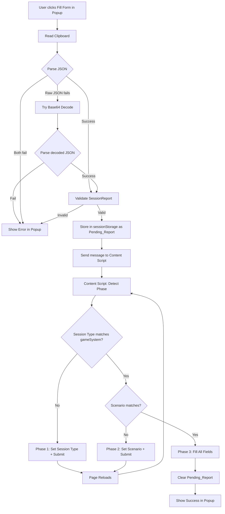
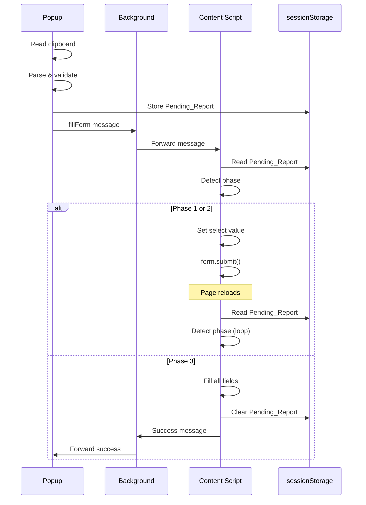
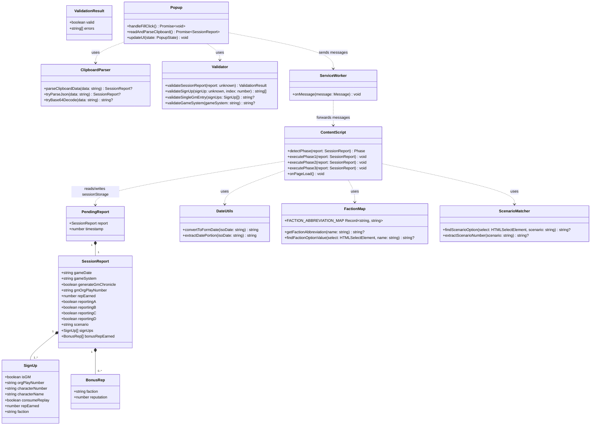
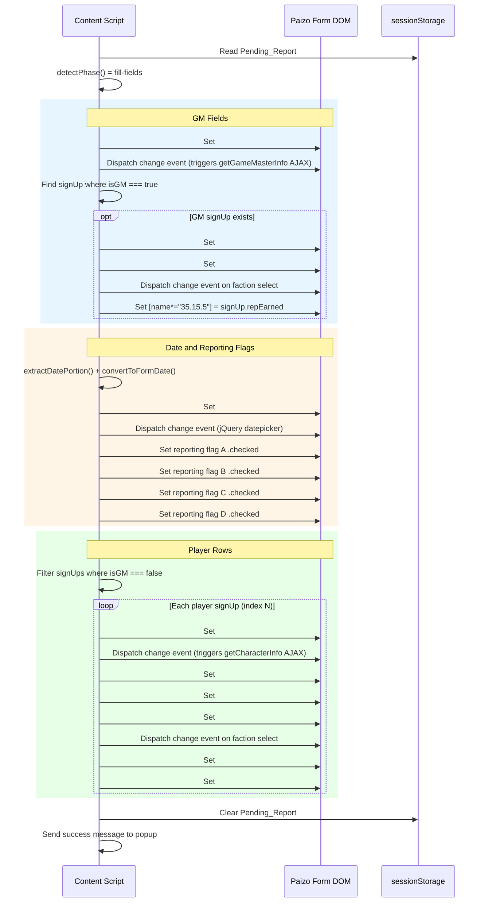

# Design Document: Paizo Session Report Browser Plugin

## Overview

This feature is a Chrome/Edge browser extension (Manifest V3) that automates filling the Paizo.com PFS2E session reporting form. The extension reads a SessionReport JSON from the clipboard (produced by the "Copy Session Report" button in pfs-chronicle-generator), decodes it if base64-encoded, validates the data, and populates the Paizo form fields across multiple page reloads.

The Paizo form uses server-side rendering with `onChange="this.form.submit()"` on the session type and scenario dropdowns. Selecting either triggers a full page reload. The extension handles this via a stateless phase detection approach: on each page load, the content script inspects the current form state against the Pending_Report data in sessionStorage to determine which phase to execute next. This makes the entire operation appear as a single click to the user.

### Key Design Decisions

1. **Stateless phase detection**: No stored phase number — the content script inspects current form state (session type selected? scenario selected?) against the Pending_Report to determine what to do next. This is more resilient to interruptions and page state variations.

2. **GM data from signUps array**: The GM's character number, faction, and reputation come from the Sign_Up entry where `isGM === true`, NOT from separate top-level fields. The SessionReport has no `gmCharacterNumber`, `gmFaction`, or `gmReputation` fields.

3. **Dual JSON format support**: The extension accepts both raw JSON and base64-encoded JSON from the clipboard, trying raw JSON first.

4. **Event dispatching safety**: Session type and scenario selects must NOT have change events dispatched (would trigger premature form.submit()). Text inputs need change events for AJAX handlers. Checkboxes set `.checked` directly.

5. **Date extraction**: The `gameDate` field may include a time/timezone suffix (e.g., `"2026-01-25T12:30:00+00:00"`). The extension extracts just the date portion (first 10 characters).

## Architecture



### Module Structure

```
src/
├── manifest.json           # Manifest V3 configuration
├── popup/
│   ├── popup.html          # Extension popup UI
│   ├── popup.css           # Popup styles
│   └── popup.ts            # Popup logic (clipboard read, validation, messaging)
├── background/
│   └── service-worker.ts   # Background service worker (message routing)
├── content/
│   └── content-script.ts   # Content script (form filling, phase detection)
├── shared/
│   ├── types.ts            # SessionReport, SignUp interfaces
│   ├── validation.ts       # SessionReport validation
│   ├── clipboard-parser.ts # JSON/base64 parsing
│   ├── date-utils.ts       # Date format conversion
│   ├── faction-map.ts      # Faction name to abbreviation mapping
│   └── scenario-matcher.ts # Scenario dropdown matching
└── constants/
    └── selectors.ts        # DOM selectors for Paizo form fields
```

### Message Flow



### Class Diagram



### Phase 3 Field Population Sequence



## Components and Interfaces

### Popup Module (`popup/popup.ts`)

Handles user interaction, clipboard reading, validation, and initiating the workflow.

```typescript
interface PopupState {
  isOnPaizoPage: boolean;
  isLoading: boolean;
  error: string | null;
  success: string | null;
}

async function handleFillClick(): Promise<void>;
async function readAndParseClipboard(): Promise<SessionReport>;
function updateUI(state: PopupState): void;
```

### Content Script Module (`content/content-script.ts`)

Injected into the Paizo form page. Handles phase detection and form filling.

```typescript
function detectPhase(report: SessionReport): Phase;
function executePhase1(): void;  // Set session type, submit
function executePhase2(report: SessionReport): void;  // Set scenario, submit
function executePhase3(report: SessionReport): void;  // Fill all fields
function onPageLoad(): void;  // Entry point, checks for Pending_Report
```

### Clipboard Parser (`shared/clipboard-parser.ts`)

Parses clipboard data as raw JSON or base64-encoded JSON.

```typescript
function parseClipboardData(data: string): SessionReport | null;
function tryParseJson(data: string): SessionReport | null;
function tryBase64Decode(data: string): string | null;
```

### Validation Module (`shared/validation.ts`)

Validates SessionReport structure and required fields.

```typescript
interface ValidationResult {
  valid: boolean;
  errors: string[];
}

function validateSessionReport(report: unknown): ValidationResult;
function validateSignUp(signUp: unknown, index: number): string[];
function validateSingleGmEntry(signUps: SignUp[]): string | null;
function validateGameSystem(gameSystem: string): string | null;
```

### Date Utilities (`shared/date-utils.ts`)

Converts ISO 8601 dates to Paizo form format.

```typescript
// Input: "2026-01-25" or "2026-01-25T12:30:00+00:00"
// Output: "01/25/2026"
function convertToFormDate(isoDate: string): string;
function extractDatePortion(isoDate: string): string;
```

### Faction Map (`shared/faction-map.ts`)

Maps full faction names to abbreviation codes.

```typescript
const FACTION_ABBREVIATION_MAP: Record<string, string> = {
  "Envoy's Alliance": "EA",
  "Grand Archive": "GA",
  "Horizon Hunters": "HH",
  "Radiant Oath": "RO",
  "Verdant Wheel": "VW",
  "Vigilant Seal": "VS"
};

function getFactionAbbreviation(factionName: string): string | null;
function findFactionOptionValue(selectElement: HTMLSelectElement, factionName: string): string | null;
```

### Scenario Matcher (`shared/scenario-matcher.ts`)

Matches scenario identifier to dropdown option.

```typescript
// Input scenario: "PFS2E 7-02"
// Searches for option text containing "#7-02:"
function findScenarioOption(selectElement: HTMLSelectElement, scenario: string): string | null;
function extractScenarioNumber(scenario: string): string | null;
```

### DOM Selectors (`constants/selectors.ts`)

Centralized selectors for Paizo form fields.

```typescript
const SELECTORS = {
  // Dropdowns with form.submit() onChange
  sessionTypeSelect: '#9',
  scenarioSelect: '[name="17.2.1.3.1.1.1.17"]',
  
  // Date field
  sessionDate: '#sessionDate',
  
  // GM fields
  gmNumber: '#gameMasterNumber',
  gmCharacterNumber: '#gameMasterCharacterNumber',
  gmName: '#gameMasterName',
  gmFactionSelect: '#gmFactionSelect',
  gmReputation: '[name*="35.15.5"]',
  
  // Reporting flags
  reportingA: '[name="17.2.1.3.1.1.1.27.1"]',
  reportingB: '[name="17.2.1.3.1.1.1.27.3"]',
  reportingC: '[name="17.2.1.3.1.1.1.27.5"]',
  reportingD: '[name="17.2.1.3.1.1.1.27.7"]',
  
  // Player row template (N = 0-5)
  playerNumber: (n: number) => `#${n}playerNumber`,
  characterNumber: (n: number) => `#${n}characterNumber`,
  characterName: (n: number) => `#${n}characterName`,
  factionSelect: (n: number) => `#${n}FactionSelect`,
  prestigePoints: (n: number) => `#${n}prestigePoints`,
  consumesReplay: (n: number) => `[name*="${n}consumesReplay"], [name*="43.${n}.1.9"]`,
  
  // Add Extra Character button
  addExtraCharacter: '[name="17.2.1.3.1.1.1.41"]',
  
  // Form element
  form: 'form[name="editObject"]'
} as const;
```

## Data Models

### SessionReport (Input from Clipboard)

This interface is defined by the pfs-chronicle-generator project. The extension consumes this data.

```typescript
interface SessionReport {
  gameDate: string;              // ISO 8601 date, may include time/timezone
  gameSystem: 'PFS2E';           // Validated: must be a supported system (currently only PFS2E)
  generateGmChronicle: boolean;  // Ignored by extension
  gmOrgPlayNumber: string;       // GM's org play number (string, may have leading zeros)
  repEarned: number;             // Ignored (always 0)
  reportingA: boolean;
  reportingB: boolean;
  reportingC: boolean;
  reportingD: boolean;
  scenario: string;              // e.g., "PFS2E 7-02"
  signUps: SignUp[];
  bonusRepEarned: BonusRep[];    // Ignored by extension
}

interface SignUp {
  isGM: boolean;                 // true for GM entry, false for players
  orgPlayNumber: string;         // Org play number (string)
  characterNumber: string;       // Character number (string)
  characterName: string;
  consumeReplay: boolean;
  repEarned: number;             // Reputation earned
  faction: string;               // Full faction name (e.g., "Envoy's Alliance")
}

interface BonusRep {
  faction: string;
  reputation: number;
}
```

### Pending_Report (sessionStorage)

The SessionReport is stored in sessionStorage with a timestamp for timeout handling.

```typescript
interface PendingReport {
  report: SessionReport;
  timestamp: number;  // Date.now() when stored
}

const STORAGE_KEY = 'pfs_session_report_pending';
const TIMEOUT_MS = 30000;  // 30 seconds
```

### Phase Detection State

```typescript
type Phase = 'session-type' | 'scenario' | 'fill-fields' | 'complete';

// Maps gameSystem values to Session_Type_Select dropdown values
const GAME_SYSTEM_TO_SELECT_VALUE: Record<string, string> = {
  PFS2E: '4',
  // Future: SFS2E: '5'
};

interface FormState {
  sessionTypeValue: string;
  scenarioValue: string;
  isSessionTypeCorrect: boolean;  // Session type matches report's gameSystem
  isScenarioSelected: boolean;
  scenarioMatchesReport: boolean;
}
```

### Paizo Form Field Values

```typescript
// Session type dropdown values
const SESSION_TYPE_VALUES = {
  PFS1E: '0',
  PACS: '1',
  PFS1E_CORE: '2',
  SFS1E: '3',
  PFS2E: '4',
  SFS2E: '5'
} as const;

// Faction dropdown values (same for GM and player selects)
const FACTION_VALUES = {
  EA: '0',  // Envoy's Alliance
  GA: '1',  // Grand Archive
  HH: '2',  // Horizon Hunters
  RO: '3',  // Radiant Oath
  VW: '4',  // Verdant Wheel
  VS: '5'   // Vigilant Seal
} as const;
```


## Correctness Properties

*A property is a characteristic or behavior that should hold true across all valid executions of a system — essentially, a formal statement about what the system should do. Properties serve as the bridge between human-readable specifications and machine-verifiable correctness guarantees.*

### Property 1: Clipboard data round-trip

*For any* valid SessionReport object, serializing it to JSON, base64-encoding the result, then passing the base64 string to `parseClipboardData` should produce an object deeply equal to the original SessionReport.

**Validates: Requirements 2.6**

### Property 2: Clipboard parser accepts both raw JSON and base64

*For any* valid SessionReport object, `parseClipboardData` should successfully parse both the raw JSON string (`JSON.stringify(report)`) and the base64-encoded JSON string (`btoa(JSON.stringify(report))`), producing equivalent objects in both cases.

**Validates: Requirements 2.2, 2.3**

### Property 3: Invalid clipboard data rejection

*For any* string that is neither valid JSON nor valid base64-encoded JSON (e.g., random alphanumeric strings that don't decode to valid JSON), `parseClipboardData` should return null.

**Validates: Requirements 2.4**

### Property 4: Validation accepts valid SessionReport objects

*For any* SessionReport with a non-empty gameDate starting with a valid YYYY-MM-DD, a non-empty scenario, a non-empty gmOrgPlayNumber, a supported gameSystem (currently "PFS2E"), at most one SignUp entry with `isGM === true`, and at least one SignUp entry where each entry has non-empty orgPlayNumber, characterNumber, characterName, and faction, `validateSessionReport` should return `{ valid: true, errors: [] }`.

**Validates: Requirements 3.1, 3.2, 3.3, 3.4, 3.5, 3.6, 3.7**

### Property 5: Validation rejects SessionReport with missing required fields

*For any* SessionReport where at least one required field is missing or empty (gameDate, scenario, gmOrgPlayNumber, or a SignUp entry with an empty orgPlayNumber/characterNumber/characterName/faction), or where gameSystem is not a supported value, or where more than one SignUp entry has `isGM === true`, `validateSessionReport` should return `{ valid: false }` with a non-empty errors array.

**Validates: Requirements 3.1, 3.2, 3.3, 3.4, 3.5, 3.6, 3.7, 3.8**

### Property 6: Phase detection correctness

*For any* SessionReport and form state, `detectPhase` should return:
- `'session-type'` when the session type select value does not match the expected value for the report's gameSystem (e.g., value `"4"` for PFS2E)
- `'scenario'` when the session type matches but the scenario select does not match the report's scenario
- `'fill-fields'` when both the session type and scenario match the report

**Validates: Requirements 4.3, 4.5, 4.7**

### Property 7: Scenario number extraction and matching

*For any* scenario string in the format `"PFS2E N-MM"` (where N is 1-9 and MM is 00-99), `extractScenarioNumber` should produce the string `"N-MM"`, and searching an options list containing an entry with text `"#N-MM: ..."` should find that option.

**Validates: Requirements 5.1, 5.2**

### Property 8: Date format conversion

*For any* valid date (year 2000-2099, month 01-12, day 01-28), with or without a time/timezone suffix appended, `convertToFormDate` should produce a string in `MM/DD/YYYY` format where the month, day, and year components match the original input date.

**Validates: Requirements 6.1, 6.3**

### Property 9: GM and player partitioning from signUps

*For any* signUps array containing exactly one entry with `isGM === true` and zero or more entries with `isGM === false`, extracting the GM entry should yield the entry with `isGM === true` (with its characterNumber, faction, and repEarned), and filtering to player entries should yield all entries with `isGM === false` in their original order.

**Validates: Requirements 7.2, 7.3, 7.4, 10.1, 10.2**

### Property 10: Faction abbreviation mapping

*For any* faction name in the set {"Envoy's Alliance", "Grand Archive", "Horizon Hunters", "Radiant Oath", "Verdant Wheel", "Vigilant Seal"}, `getFactionAbbreviation` should return the corresponding abbreviation code, and searching a select element whose options have text in the format `"XX - Full Name"` should find the matching option.

**Validates: Requirements 8.1, 8.2**

### Property 11: Paizo URL detection

*For any* URL string, the URL matcher should return true if and only if the URL matches the Paizo event reporter page pattern (containing the Paizo organized play reporting path).

**Validates: Requirements 11.1**

### Property 12: Pending report timeout detection

*For any* PendingReport with a timestamp, the timeout check should return true if and only if `Date.now() - timestamp > 30000` (30 seconds).

**Validates: Requirements 15.1**

## Error Handling

### Clipboard Errors
- If `navigator.clipboard.readText()` rejects (permissions denied, insecure context, empty clipboard), the popup displays a specific error message and the fill button remains enabled for retry.
- Error message: "Could not read clipboard. Make sure you've copied the session report data."

### Parse Errors
- If clipboard data is neither valid JSON nor valid base64-encoded JSON, the popup displays: "Clipboard does not contain valid session report data. Copy the report from pfs-chronicle-generator first."
- If the parsed JSON doesn't conform to the SessionReport structure, validation errors are displayed individually.

### Validation Errors
- Each validation failure produces a specific error message:
  - Missing gameDate: "Session report is missing the game date."
  - Missing scenario: "Session report is missing the scenario."
  - Missing gmOrgPlayNumber: "Session report is missing the GM org play number."
  - Empty signUps: "Session report has no sign-up entries."
  - SignUp missing field: "Sign-up entry {index}: missing {fieldName}."
  - Multiple GM entries: "Session report has multiple sign-up entries marked as GM."
  - Unsupported game system: "Game system '{gameSystem}' is not supported at this time."
- All errors are collected and displayed together in the popup.

### Scenario Matching Errors
- If the scenario from the SessionReport doesn't match any dropdown option, the content script clears the Pending_Report, and the popup displays: "Scenario '{scenario}' was not found in the Paizo form dropdown."

### Timeout Errors
- If the Pending_Report has been in sessionStorage for more than 30 seconds, the content script clears it and stops. No error is displayed (the workflow silently expires).

### Form Field Errors
- If expected form fields are not found on the page (e.g., `#gameMasterNumber` doesn't exist), the content script clears the Pending_Report and sends an error message to the popup: "Could not find expected form fields. Make sure you're on the Paizo session reporting page."

### Unknown Faction
- If a faction name from the SessionReport doesn't match any entry in the Faction_Abbreviation_Map, the faction dropdown is left at its default "Select a Faction..." value and a warning is logged to the console.

## Testing Strategy

### Property-Based Testing

The extension will use `fast-check` for property-based testing. All correctness properties will be implemented as property tests.

Each property test must:
- Run a minimum of 100 iterations
- Reference the design property with a tag comment: `Feature: paizo-session-report-browser-plugin, Property N: {title}`
- Use `fc.uniqueArray` with selectors when generating arrays of SignUp records with unique orgPlayNumber fields
- Use positive assertions (`toBe`, `toEqual`) over negative assertions (`not.toBe`)

Property test files:
- `src/shared/clipboard-parser.property.test.ts` — Properties 1, 2, 3
- `src/shared/validation.property.test.ts` — Properties 4, 5
- `src/content/phase-detection.property.test.ts` — Property 6
- `src/shared/scenario-matcher.property.test.ts` — Property 7
- `src/shared/date-utils.property.test.ts` — Property 8
- `src/shared/signup-utils.property.test.ts` — Property 9
- `src/shared/faction-map.property.test.ts` — Property 10
- `src/shared/url-matcher.property.test.ts` — Property 11
- `src/shared/timeout-utils.property.test.ts` — Property 12

### Unit Testing

Unit tests complement property tests for specific examples, edge cases, and integration points:

- `src/shared/clipboard-parser.test.ts` — Specific examples: valid raw JSON, valid base64, empty string, random garbage, truncated base64
- `src/shared/validation.test.ts` — Edge cases: gameDate with time suffix, signUps with only GM entry (no players), all fields empty
- `src/shared/scenario-matcher.test.ts` — Edge cases: bounty scenarios, quest scenarios, special scenarios with level ranges (e.g., "#2-00: The King in Thorns [Levels 1-2]"), scenario not found
- `src/shared/date-utils.test.ts` — Specific examples: "2026-01-25" → "01/25/2026", "2026-01-25T12:30:00+00:00" → "01/25/2026", leap year dates
- `src/shared/faction-map.test.ts` — Example: all six factions map correctly, unknown faction returns null
- `src/content/content-script.test.ts` — Integration tests with JSDOM: phase detection with mock form, field population verification, event dispatching verification (change events on text inputs, no change events on session type/scenario selects, .checked on checkboxes)
- `src/popup/popup.test.ts` — Popup UI state transitions, error display, success display

