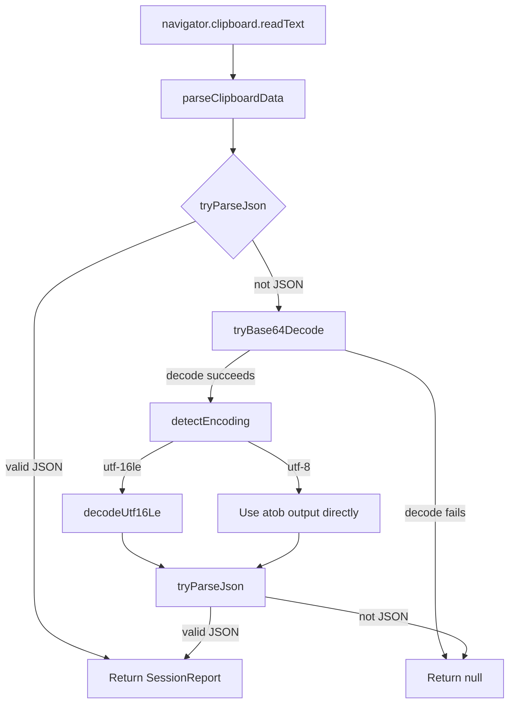

# Design Document: UTF-16LE Clipboard Encoding

## Overview

The pfs-chronicle-generator encodes SessionReport data as UTF-16LE bytes inside a base64 payload before writing it to the clipboard. The pfs-session-reporter extension currently assumes the base64 payload decodes to UTF-8 text (the `atob()` output used directly as a string). This design adds encoding detection and UTF-16LE decoding to the existing `clipboard-parser.ts` module so that the Dual_Parsing_Pipeline correctly handles both UTF-16LE and UTF-8 base64 payloads.

The change is scoped entirely to the base64 decode path within `clipboard-parser.ts`. The raw JSON parsing path and the clipboard reading mechanism (`navigator.clipboard.readText()`) remain unchanged.

### Key Design Decisions

1. **Single-module approach**: All new functions (`detectEncoding`, `decodeUtf16Le`) are added to `clipboard-parser.ts` rather than creating new modules. The functions are small, cohesive, and directly related to clipboard parsing. This keeps imports simple and avoids unnecessary file proliferation.

2. **Null-byte heuristic with early sampling**: The encoding detector checks a configurable sample of odd-indexed bytes rather than scanning the entire payload. For typical SessionReport payloads (a few KB), a full scan is negligible, but the sample cap provides a safety net for unexpectedly large inputs.

3. **Graceful degradation**: Odd-length binary strings and empty strings default to `utf-8`, which is the simpler interpretation. The UTF-16LE decoder silently drops a trailing odd byte rather than throwing.

## Architecture

The change modifies one module in the existing architecture. No new modules, message flows, or storage mechanisms are introduced.



The only change to the existing flow is the insertion of the `detectEncoding` → conditional `decodeUtf16Le` step between `tryBase64Decode` and the final `tryParseJson` call.

## Components and Interfaces

### Modified Module: `clipboard-parser.ts`

#### New Exported Functions

```typescript
type EncodingType = 'utf-16le' | 'utf-8';

/**
 * Detect whether atob() output bytes represent UTF-16LE or UTF-8 text.
 *
 * Uses the Null_Byte_Heuristic: UTF-16LE encoded ASCII text has 0x00
 * at every odd byte position. Samples up to maxSampleBytes odd positions
 * to avoid scanning very large payloads.
 *
 * Returns 'utf-8' for empty strings, odd-length strings, or when any
 * sampled odd-indexed byte is non-zero.
 */
export function detectEncoding(
  binaryString: string,
  maxSampleBytes?: number
): EncodingType;

/**
 * Interpret atob() output bytes as UTF-16LE pairs and return the
 * decoded string.
 *
 * Reads bytes in pairs: character = lowByte + (highByte << 8).
 * Silently ignores a trailing byte if the input has odd length.
 */
export function decodeUtf16Le(binaryString: string): string;
```

#### Modified Exported Function

```typescript
/**
 * Parse clipboard data as a SessionReport.
 * Tries raw JSON first; on failure, tries base64 decode, detects
 * encoding, decodes accordingly, then tries JSON parse.
 */
export function parseClipboardData(data: string): SessionReport | null;
```

The internal logic of `parseClipboardData` changes from:

```typescript
// Before
const decoded = tryBase64Decode(data);
if (decoded) {
  return tryParseJson(decoded);
}
```

to:

```typescript
// After
const decoded = tryBase64Decode(data);
if (decoded) {
  const encoding = detectEncoding(decoded);
  const text = encoding === 'utf-16le'
    ? decodeUtf16Le(decoded)
    : decoded;
  return tryParseJson(text);
}
```

`tryParseJson` and `tryBase64Decode` remain unchanged.

### Unchanged Modules

- `popup.ts` — continues calling `parseClipboardData()` with the clipboard text string
- `types.ts` — `SessionReport` interface unchanged
- `validation.ts` — validation logic unchanged

## Data Models

No new data models are introduced. The existing `SessionReport` interface is the only data structure flowing through the pipeline.

### Encoding Type

A string literal union type is used for the encoding detection result:

```typescript
type EncodingType = 'utf-16le' | 'utf-8';
```

This is a local type within `clipboard-parser.ts`, not a shared type, since it is only relevant to the decoding logic.

### Binary String Representation

The `atob()` function returns a "binary string" where each character's char code corresponds to one byte (0x00–0xFF). This is the standard Web API behavior. Both `detectEncoding` and `decodeUtf16Le` operate on this binary string representation — no `Uint8Array` conversion is needed on the decode side.


## Correctness Properties

*A property is a characteristic or behavior that should hold true across all valid executions of a system — essentially, a formal statement about what the system should do. Properties serve as the bridge between human-readable specifications and machine-verifiable correctness guarantees.*

### Property 1: UTF-16LE Encoding Detection

*For any* valid SessionReport object, serializing it with `encodeUtf16LeBase64` and then passing the `atob()` output to `detectEncoding` should return `'utf-16le'`.

This is a detection correctness property: the detector must recognize the null-byte pattern produced by the real encoder. Since `encodeUtf16LeBase64` writes every ASCII character as `[charCode, 0x00]`, every odd-indexed byte in the `atob()` output is 0x00, which is exactly the pattern the heuristic checks for.

**Validates: Requirements 1.2, 6.4**

### Property 2: UTF-8 Encoding Detection

*For any* ASCII-range JSON string, encoding it as UTF-8 base64 via `btoa()` and then passing the `atob()` output to `detectEncoding` should return `'utf-8'`.

This validates the complementary detection path. UTF-8 encoded ASCII text contains no null bytes, so no odd-indexed byte is 0x00, and the string length is odd or even without the null-byte pattern. The detector must correctly classify these as UTF-8.

**Validates: Requirements 1.3, 1.4, 6.5**

### Property 3: UTF-16LE Decode Round-Trip

*For any* string containing characters in the BMP range (U+0000–U+FFFF), encoding it as UTF-16LE bytes via `encodeUtf16LeBase64`, base64-decoding with `atob()`, then interpreting with `decodeUtf16Le` should produce the original string.

This is a round-trip property that validates the decode function is the inverse of the encode function. It uses the real encoder from `pfs-chronicle-generator` as the encoding side.

**Validates: Requirements 2.2, 5.2, 5.4**

### Property 4: UTF-16LE End-to-End Round-Trip

*For any* valid SessionReport object, serializing with `serializeSessionReport(report, false)` (UTF-16LE base64 mode) then parsing with `parseClipboardData` should produce an object deeply equal to the original SessionReport.

This is the primary end-to-end property for this feature. It validates the full pipeline: JSON.stringify → UTF-16LE encode → base64 encode → base64 decode → encoding detection → UTF-16LE decode → JSON.parse. If this property holds, the extension correctly handles clipboard data from the chronicle generator's default mode.

**Validates: Requirements 6.1**

### Property 5: Invalid Data Rejection

*For any* string that is neither a valid JSON object nor a valid base64 encoding of a JSON object (in either UTF-8 or UTF-16LE), `parseClipboardData` should return `null`.

This property already exists in the test suite (Property 3 in the existing `clipboard-parser.property.test.ts`). It must continue to hold after the changes. The updated base64 decode path adds encoding detection and conditional UTF-16LE decoding, but invalid inputs must still be rejected.

**Validates: Requirements 2.5, 2.6**

## Error Handling

The error handling strategy follows the existing pattern in `clipboard-parser.ts`: functions return `null` on failure rather than throwing exceptions. This is consistent with the Dual_Parsing_Pipeline's fallthrough design.

| Scenario | Behavior |
|---|---|
| Empty binary string passed to `detectEncoding` | Returns `'utf-8'` (edge case, not an error) |
| Odd-length binary string passed to `decodeUtf16Le` | Ignores trailing byte, returns decoded string from complete pairs |
| Invalid base64 input to `tryBase64Decode` | Returns `null` (existing behavior, unchanged) |
| Valid base64 but decoded bytes are not valid JSON in either encoding | `tryParseJson` returns `null` (existing behavior) |
| `navigator.clipboard.readText()` fails | `popup.ts` displays error message (existing behavior, unchanged) |

No new exception types or error codes are introduced. The `try/catch` in `tryBase64Decode` and `tryParseJson` remain the only exception boundaries.

## Testing Strategy

### Property-Based Tests

Property-based tests use `fast-check` (already a devDependency) with a minimum of 100 iterations per property. Tests are added to the existing `clipboard-parser.property.test.ts` file.

Each property test is tagged with a comment referencing the design property:
```
Feature: utf16le-clipboard-encoding, Property {N}: {title}
```

| Property | Test Description | Generator Strategy |
|---|---|---|
| Property 1 | Generate random SessionReport → serialize with `encodeUtf16LeBase64` → `atob()` → `detectEncoding` → assert `'utf-16le'` | Reuse existing `sessionReportArbitrary` |
| Property 2 | Generate random ASCII JSON objects → `btoa()` → `atob()` → `detectEncoding` → assert `'utf-8'` | `fc.record` with ASCII string fields → `JSON.stringify` |
| Property 3 | Generate random ASCII strings → `encodeUtf16LeBase64` → `atob()` → `decodeUtf16Le` → assert equals original | `fc.string` with `grapheme-ascii` unit |
| Property 4 | Generate random SessionReport → `serializeSessionReport(report, false)` → `parseClipboardData` → assert deep equals original | Reuse existing `sessionReportArbitrary` |
| Property 5 | Generate random non-JSON non-base64-JSON strings → `parseClipboardData` → assert `null` | Already exists in test suite |

Properties 1–4 are new tests. Property 5 already exists and must continue passing.

### Unit Tests

Unit tests cover specific examples and edge cases in a `clipboard-parser.test.ts` file:

- `detectEncoding` with empty string → `'utf-8'`
- `detectEncoding` with a known UTF-16LE binary string (e.g., `atob(encodeUtf16LeBase64('{"a":1}'))`) → `'utf-16le'`
- `detectEncoding` with a known UTF-8 binary string (e.g., `atob(btoa('{"a":1}'))`) → `'utf-8'`
- `decodeUtf16Le` with a known UTF-16LE binary string → correct decoded string
- `decodeUtf16Le` with odd-length input → ignores trailing byte, no error
- `parseClipboardData` with a UTF-16LE base64 payload → correct SessionReport
- `parseClipboardData` with a UTF-8 base64 payload → correct SessionReport (existing behavior)
- `parseClipboardData` with raw JSON → correct SessionReport (existing behavior)
- `parseClipboardData` with garbage input → `null`

### Cross-Project Testing Note

Properties 3 and 4 import `encodeUtf16LeBase64` from `pfs-chronicle-generator`. Since both projects live in the same monorepo (`pfs-tools/`), the test file can import the encoder directly via a relative path or a shared package reference. If cross-project imports are not feasible in the test runner configuration, the test can inline a copy of the encoder function (it's 8 lines) with a comment referencing the source.
